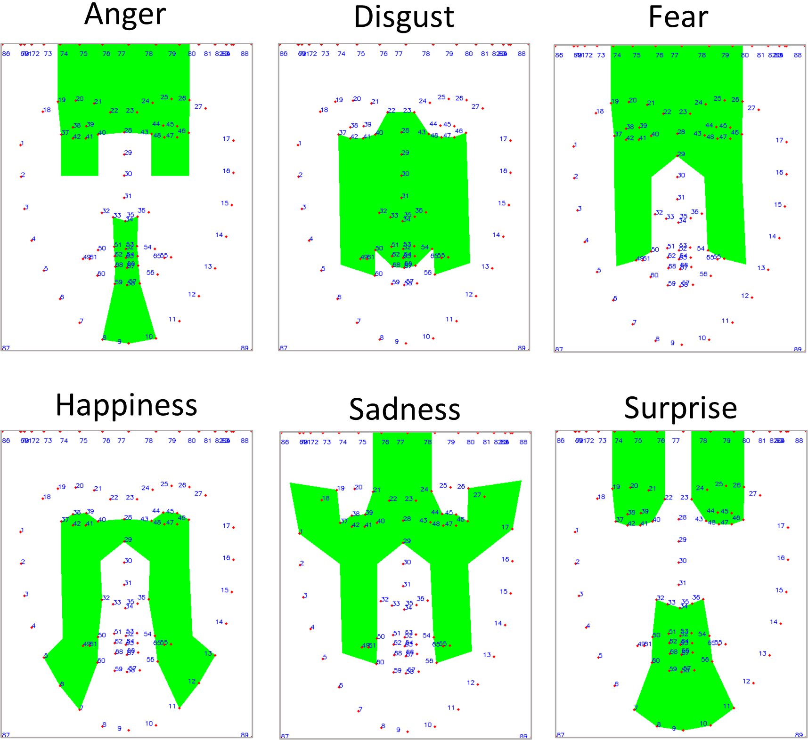

# ekman_expressions

This repository contains all the code used for the scientific article titled *"Unveiling the Human-like Similarities of Automatic Facial Expression Recognition: An Empirical Exploration through Explainable AI"*.

## Installation

1. Clone the repository: `git clone https://github.com/Xavi3398/ekman_expressions.git`
2. Navigate to the repository's directory: `cd ekman_expressions`
3. Install the project dependencies: `pip install -r requirements.txt`
4. Install the package: `pip install .`


## Usage

To reproduce the results presented in the article, run every notebook in the [notebooks](./notebooks) folder.

**Note**: we have no permission to distribute the datasets used in the article, so they are not included in this project, and neither are the results displaying their images.

## Project structure
For simplicity, the project is structured in different folders:

- **[notebooks](./notebooks)**: all code needed to reproduce the experiments in the article.
- **[datasets](./datasets)**: datasets to use in the experiments. This folder is empty because we have no rights over the distribution of the datatasets.
- **[models](./models)**: saved weights of the trained models.
- **[results](./results)**: local explanation results, including selection of 100 postivies per class, application of LIME, and normalization steps.
- **[heatmaps](./heatmaps)**: computed global explanations, aggregating the local explanations by classes, by classes and networks, and by classes, networks, and k-cross validation sets. It also contains the computed Ekman GT masks under [heatmaps/GROUND_TRUTH](./heatmaps/GROUND_TRUTH).
- **[barplots](./barplots)**: charts displaying the difference between Ekman GT masks and the heatmaps.
- **[dendograms](./dendograms)**: charts displaying the similarities between heatmaps in a hierarchic manner.

## Overview

### Datasets used for training:
The datasets used were 5: CK+, BU-4DFE, JAFFE and WSEFEP, and FEGA. These are some examples from each class:


### Models:
We explored 12 different Deep Learning models:

| Model          | Image Size | Pre-training | Parameters |
|----------------------|---------------------|-----------------------|---------------------|
| AlexNet        | 224x224             | No                    | 88.7 M              |
| WeiNet         | 64x64               | No                    | 1.7 M               |
| SongNet        | 224x224             | No                    | 172.7 K             |
| SilNet         | 150x150             | No                    | 184.9 M             |
| VGG16          | 224x224             | Yes                   | 14.7 M              |
| VGG19          | 224x224             | Yes                   | 20 M                |
| ResNet50       | 224x224             | Yes                   | 23.6 M              |
| ResNet101V2    | 224x224             | Yes                   | 42.6 M              |
| InceptionV3    | 224x224             | Yes                   | 21.8 M              |
| Xception       | 224x224             | Yes                   | 20.9 M              |
| MobileNetV3    | 224x224             | Yes                   | 3 M                 |
| EfficientNetV2 | 224x224             | Yes                   | 5.9 M               |

### Explanations
Global explanations were extracted from local (LIME) ones. To do so, the explanations were aggregated after transforming them to a normalized space. This are some examples of every computation step:


### Ekman GT masks
We constructed "ground truth" masks to represent the important regions of the face to recognize each facial expression, following the work of Ekman et al.



These are the results when comparing the Ekman GT masks with thresholded heatmaps for each network and class:

|          |Anger | | Disgust | | Fear | | Happiness | | Sadness | | Surprise | | Avg. (model) | |
|------------|------------------------------------|----------------------------------------|-------------------------------------|------------------------------------------|----------------------------------------|-----------------------------------------|-------------------------------------------|-----------------|--|--|--|--|--|--|
|| **IoU** | **F1 sc.** | **IoU**                        | **F1 sc.**                          | **IoU**                           | **F1 sc.**                         | **IoU** **IoU** | **F1 sc.** | **IoU** | **F1 sc.** | **IoU** | **F1 sc.** | **IoU** | **F1 sc.** |
| **SilNet**            | 0,2062     | 0,3389          | 0,3841     | 0,5527          | 0,3367     | 0,5027          | 0,1141     | 0,2045          | 0,2629     | 0,4158          | 0,2785     | 0,4341          | 0,2637           | 0,4081                |
| **WeiNet**            | 0,2090     | 0,3439          | 0,3042     | 0,4607          | 0,2505     | 0,3992          | 0,0988     | 0,1798          | 0,2844     | 0,4426          | 0,1380     | 0,2384          | 0,2141           | 0,3441                |
| **AlexNet**           | 0,2921     | 0,4455          | 0,2329     | 0,3748          | 0,1294     | 0,2284          | 0,1151     | 0,2056          | 0,2948     | 0,4551          | 0,1874     | 0,3146          | 0,2086           | 0,3373                |
| **SongNet**           | 0,3139     | 0,4706          | 0,2353     | 0,3688          | 0,1309     | 0,2220          | 0,2338     | 0,3726          | 0,2370     | 0,3795          | 0,1516     | 0,2605          | 0,2171           | 0,3457                |
| **InceptionV3**       | 0,2801     | 0,4315          | 0,5923     | 0,7430          | 0,2543     | 0,4033          | 0,2297     | 0,3727          | 0,2815     | 0,4377          | 0,2387     | 0,3850          | 0,3128           | 0,4622                |
| **VGG19**             | 0,1738     | 0,2842          | 0,5580     | 0,7147          | 0,1066     | 0,1855          | 0,1595     | 0,2747          | 0,1448     | 0,2434          | 0,3041     | 0,4660          | 0,2411           | 0,3614                |
| **VGG16**             | 0,1231     | 0,2183          | 0,4180     | 0,5621          | 0,1112     | 0,1963          | 0,1508     | 0,2615          | 0,1834     | 0,2928          | 0,2805     | 0,4369          | 0,2112           | 0,3280                |
| **ResNet50**          | 0,2112     | 0,3446          | 0,4107     | 0,5746          | 0,2063     | 0,3375          | 0,2845     | 0,4400          | 0,3119     | 0,4526          | 0,2820     | 0,4389          | 0,2844           | 0,4314                |
| **ResNet101V2**       | 0,1919     | 0,3148          | 0,5048     | 0,6653          | 0,1610     | 0,2736          | 0,2611     | 0,4135          | 0,2537     | 0,3963          | 0,2817     | 0,4382          | 0,2757           | 0,4170                |
| **Xception**          | 0,1052     | 0,1862          | 0,3304     | 0,4860          | 0,1694     | 0,2857          | 0,2334     | 0,3774          | 0,2311     | 0,3689          | 0,2363     | 0,3810          | 0,2176           | 0,3475                |
| **MobileNetV3Large**  | 0,3532     | 0,5091          | 0,4980     | 0,6615          | 0,1633     | 0,2593          | 0,1966     | 0,3267          | 0,1163     | 0,2077          | 0,1902     | 0,3136          | 0,2529           | 0,3797                |
| **EfficientNetV2B0**  | 0,2595     | 0,4016          | 0,5396     | 0,6956          | 0,1672     | 0,2720          | 0,2617     | 0,4119          | 0,1172     | 0,2045          | 0,2864     | 0,4445          | 0,2719           | 0,4050                |
| **Avg. (expression)**     | 0,2266     | 0,3574          | 0,4174     | 0,5717          | 0,1822     | 0,2971          | 0,1949     | 0,3201          | 0,2266     | 0,3581          | 0,2379     | 0,3793          | 0,2476           | 0,3806                |


|                       | Anger  |        | Disgust |        | Fear   |        | Happiness |        | Sadness |        | Surprise |        | Avg. (model) |        |
|----------|--------|--------|---------|--------|--------|--------|-----------|--------|---------|--------|----------|--------|--------------|--------|
|                       | **Prec.**  | **Recall** | **Prec.**   | **Recall** | **Prec.**  | **Recall** | **Prec.**     | **Recall** | **Prec.**   | **Recall** | **Prec.**    | **Recall** | **Prec.**        | **Recall** |
| **SilNet**            | 0.2942 | 0.4082 | 0.4919  | 0.6531 | 0.4836 | 0.5285 | 0.2146    | 0.2011 | 0.5574  | 0.3455 | 0.4093   | 0.4749 | 0.4085       | 0.4352 |
| **WeiNet**            | 0.3271 | 0.3720 | 0.4577  | 0.5513 | 0.4481 | 0.3623 | 0.1904    | 0.1708 | 0.6167  | 0.3490 | 0.2771   | 0.2565 | 0.3862       | 0.3436 |
| **AlexNet**           | 0.4044 | 0.5029 | 0.7753  | 0.2996 | 0.3114 | 0.1887 | 0.2160    | 0.1983 | 0.5070  | 0.4190 | 0.3275   | 0.3142 | 0.4236       | 0.3205 |
| **SongNet**           | 0.4500 | 0.5113 | 0.3427  | 0.4042 | 0.2377 | 0.2132 | 0.3504    | 0.4017 | 0.4787  | 0.3267 | 0.2466   | 0.2776 | 0.3510       | 0.3558 |
| **InceptionV3**       | 0.4327 | 0.4378 | 0.6499  | 0.8744 | 0.4235 | 0.4109 | 0.3932    | 0.3556 | 0.4670  | 0.4134 | 0.3498   | 0.4288 | 0.4527       | 0.4868 |
| **VGG19**             | 0.3023 | 0.3008 | 0.6786  | 0.7725 | 0.2777 | 0.1408 | 0.3363    | 0.2326 | 0.3788  | 0.1918 | 0.5301   | 0.4169 | 0.4173       | 0.3426 |
| **VGG16**             | 0.2512 | 0.1968 | 0.5692  | 0.6006 | 0.2959 | 0.1480 | 0.3438    | 0.2123 | 0.3627  | 0.2597 | 0.5335   | 0.3790 | 0.3927       | 0.2994 |
| **ResNet50**          | 0.3138 | 0.3880 | 0.5231  | 0.6399 | 0.3648 | 0.3262 | 0.4290    | 0.4647 | 0.4053  | 0.5348 | 0.5313   | 0.3919 | 0.4279       | 0.4576 |
| **ResNet101V2**       | 0.2880 | 0.3686 | 0.6265  | 0.7247 | 0.4937 | 0.1972 | 0.4290    | 0.4001 | 0.4618  | 0.3627 | 0.5122   | 0.4106 | 0.4685       | 0.4107 |
| **Xception**          | 0.2052 | 0.1882 | 0.4623  | 0.5641 | 0.3119 | 0.2653 | 0.4067    | 0.3529 | 0.4104  | 0.3395 | 0.3448   | 0.4344 | 0.3569       | 0.3574 |
| **MobileNetV3Large**  | 0.5075 | 0.5144 | 0.5676  | 0.8016 | 0.2659 | 0.2581 | 0.3896    | 0.2852 | 0.2776  | 0.1690 | 0.4131   | 0.3139 | 0.4036       | 0.3903 |
| **EfficientNetV2B0**  | 0.3864 | 0.4305 | 0.8284  | 0.6226 | 0.2882 | 0.2627 | 0.4243    | 0.4048 | 0.2889  | 0.1631 | 0.5132   | 0.4115 | 0.4549       | 0.3825 |
| **Avg. (expression)** | 0.3469 | 0.3850 | 0.5811  | 0.6257 | 0.3502 | 0.2752 | 0.3436    | 0.3067 | 0.4344  | 0.3229 | 0.4157   | 0.3759 | 0.4120       | 0.3819 |


### Heatmaps
Following the described process to obtain global explanations, a series of heatmaps are obtained.

They can represent the importance by expressions:


And by expressions and networks:


### Similarities between networks
We also explored the similarities between the computed heatmaps by networks and classes. We used the normalized correlation coeficient to compute the distances.


## License

This project is licensed under the terms of the MIT license. See the [LICENSE](LICENSE) file for details.

## Acknowledgments
Grant PID2019-104829RA-I00 funded by MCIN/ AEI /10.13039/501100011033. Project EXPLainable Artificial INtelligence systems for health and well-beING (EXPLAINING)

This work is part of the Project PID2022-136779OB-C32 (PLEISAR) funded by MICIU/ AEI /10.13039/501100011033/ and FEDER, EU. Project Playful Experiences with Interactive Social Agents and Robots (PLEISAR): Social Learning and Intergenerational Communication.

F. X. Gaya-Morey was supported by an FPU scholarship from the Ministry of European Funds, University and Culture of the Government of the Balearic Islands.

## Citation

If you use this code in your research, please cite our paper:

```
@misc{gayamorey2024unveilinghumanlikesimilaritiesautomatic,
      title={Unveiling the Human-like Similarities of Automatic Facial Expression Recognition: An Empirical Exploration through Explainable AI}, 
      author={F. Xavier Gaya-Morey and Silvia Ramis-Guarinos and Cristina Manresa-Yee and Jose M. Buades-Rubio},
      year={2024},
      eprint={2401.11835},
      archivePrefix={arXiv},
      primaryClass={cs.CV},
      url={https://arxiv.org/abs/2401.11835}, 
}
```

## Contact

If you have any questions or feedback, please feel free to contact the authors.
